# Emulator Files Check

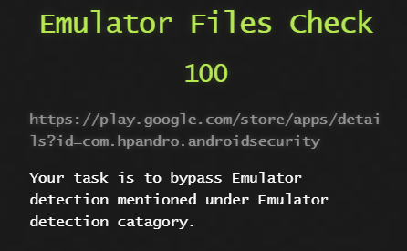

This is the first challenge I decided to check out after finding this website.
The challenge is to bypass emulator detection and you can reasonably infer from the title that the detection will be based on common emulator files.

The challenge can be found in the app menu under *Menu -> Emulator Detection -> Emulator Files Check*

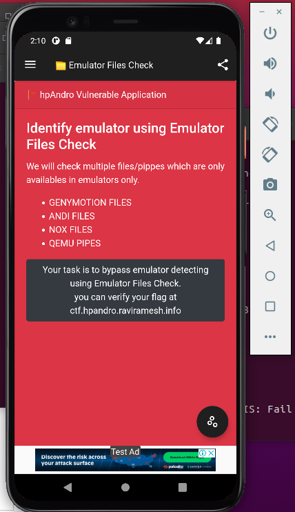

The apps menu for this challenge confirms that the challenge will be looking for specific files and pipes that exist only for a handful of specific emulators.

If I click through to the challenge itself by clicking on the gear icon and then the task button i'm presented with a simple screen with a single *Detect Emulator* button


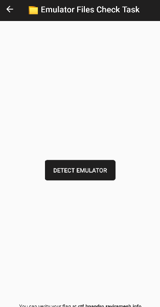

So the challenge appears to be clicking the button and not having any emulators detected.
This could probably just be solved by installing the app on my main phone and getting the flag but i'm here to learn not to get internet points.
So i'll click the button and see what happens.

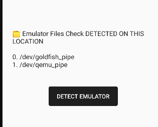

aaaaand busted.
Cool, that's what I expected.

Time to crack open the app and look for where the code I want to mess with might reside.
I haven't learn any tricks for attaching apps to debuggers yet so it'll be all static for now.

Firstly I'll run [dex2jar](https://github.com/pxb1988/dex2jar) to convert the app's .apk into a java .jar file which can be decompiled.

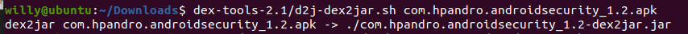

Then i'll open the .jar file in the [Java Decompiler JD-GUI](http://java-decompiler.github.io/)

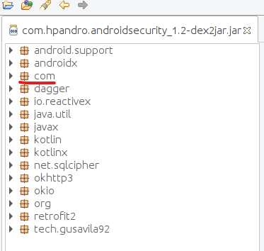

After a bit of poking about I see that under *Com -> hpandro.androidsecurity -> ui -> activity -> task* there are several folders that sound like challenge names, including emulatorDetection

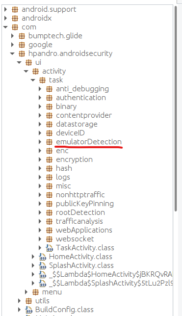

Drilling into this folder shows several classes that also look like they might be the subchallenges under the emulator detection category on the site.

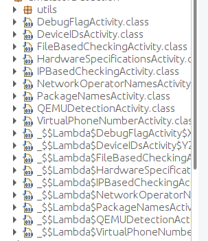

After poking around in all of the class files for a bit (and considering this is the FILE based detection challange), I start looking at what functionality exists in the 
*FileBasedCheckingActivity.class* file.

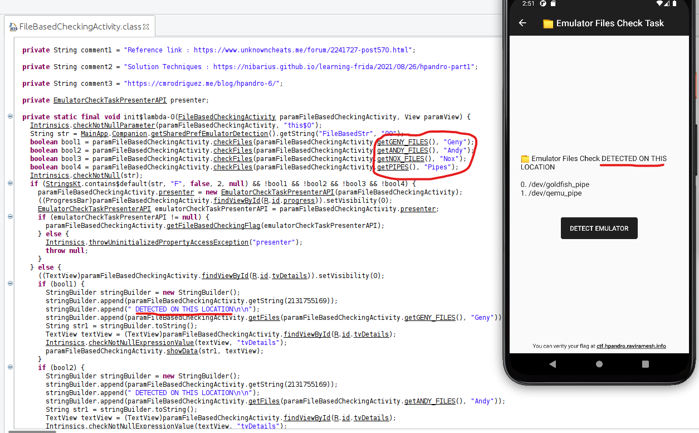

Sure enough, the file contains strings that are displayed when the emulator detection checks pass and theres plenty of hinted functionality by method names that this class is doing the checks for emulator files.

Now I just need to pick a class method that seems like a good candidate for injection.
After some deliberating, I picked this method:

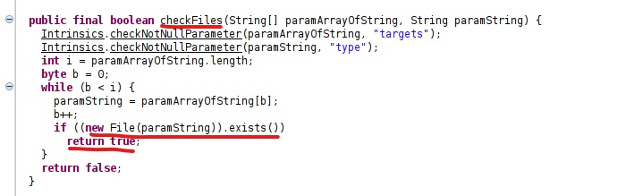

There are no doubt numerous ways to solve this, but this method looks easy. It appears to receive an array of files and then loops over them, returning *true* if any of them exist.
The obvious counter to this is to remove the ability to return true and just make this method always return false. Meaning no emulator files will ever be flagged as existing.

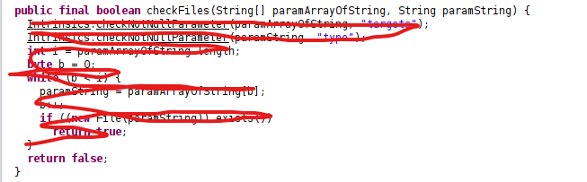

So I fired up Frida and used a bunch of boilerplate code that I'd learned from reading some blogs earlier in the day.

```python
import frida
import sys

# Create the injection script
jscript = """
Java.perform(function() {
    // Obtain a reference to the currently running FileBasedCheckingActivity
    var emdetect = Java.use('com.hpandro.androidsecurity.ui.activity.task.emulatorDetection.FileBasedCheckingActivity');
    // Obtain a reference to the checkFiles function and overwrite it with a barebones function that returns False
    emdetect.checkFiles.implementation = function (s1, s2) {
        // No emulator file will ever return true
        return false;
    };
});
"""

# Access the ADB emulator device and attach to the currently running Android security testing App
process = frida.get_usb_device().attach("Android Security Testing")
# Return a new frida script object with the custom script
script = process.create_script(jscript)
# inject the script
script.load()
sys.stdin.read()
```

I learn execute that python script with the target app running and frida should have injected my checkFiles function logic into the app.

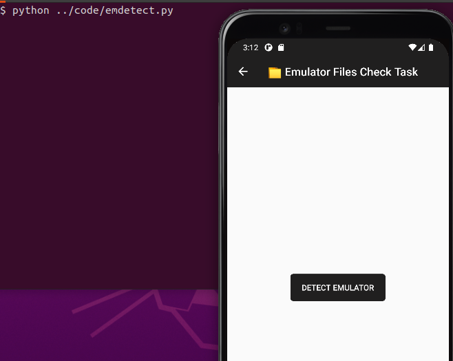

Now all I need to do is click the button and the checkFiles function will return false, telling the app that there are no emulator files.

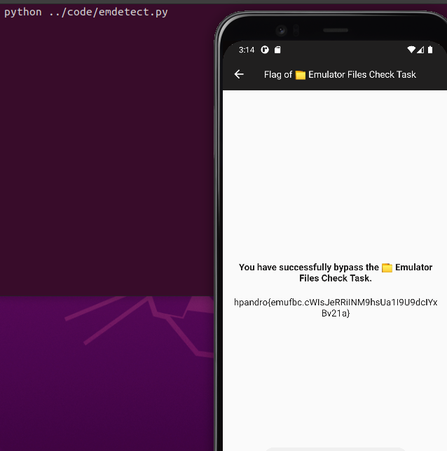

Success!
That was fun
